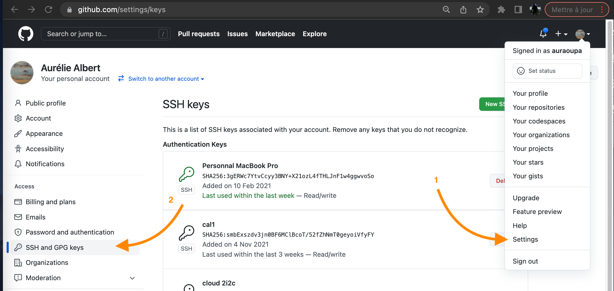
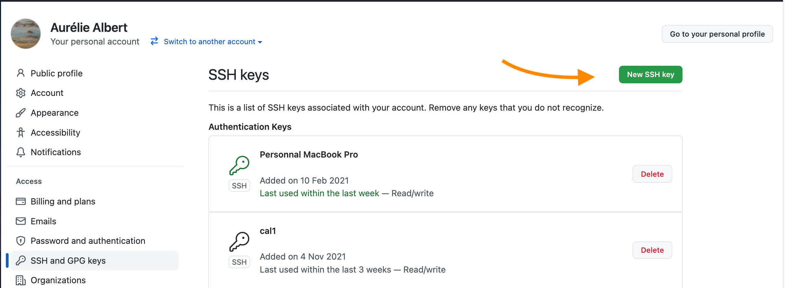
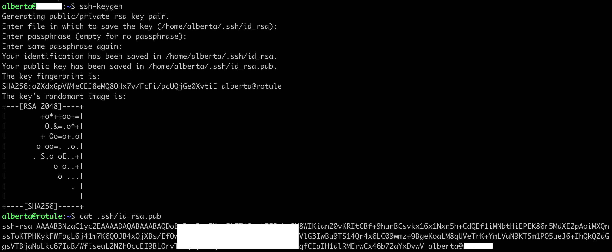
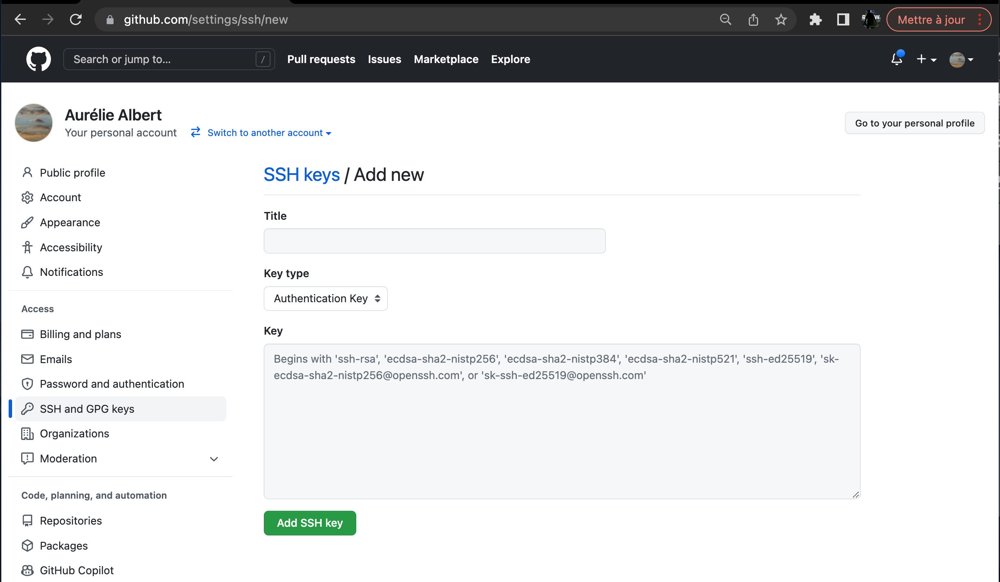
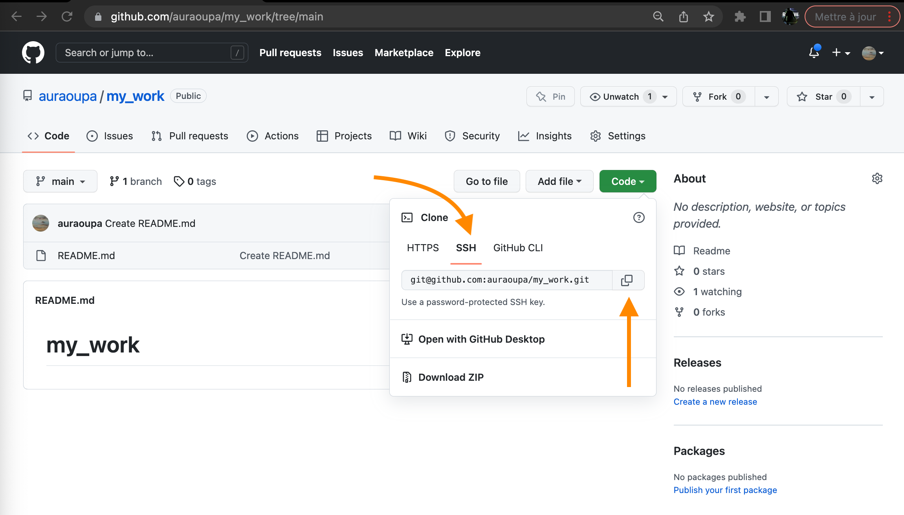

# How to use git and github to back up your work

## Table of contents

1. [Create a project on github](#create-a-project-on-github)
2. [Add a ssh key for your machine](#add-a-ssh-key-for-your-machine)
3. [Clone your project on your machine](#clone-your-project-on-your-machine)
4. [Save your work on github](#save-your-work-on-github)
5. [Synchronize your work on multiple machines](#synchronize-your-work-on-multiple-machines)
6. [Ressources](#ressources)

## Create a project on github
 - create an account on [github](https://github.com) or on [GRICAD's gitlab](https://gricad-gitlab.univ-grenoble-alpes.fr/users/sign_in)
 - create a new repository or project, let's call it **my_work** as an example
 - you can add a description in the README.md file when creating the project
 - you can now create new files or upload files directly on github/gitlab
 
 
## Add a ssh key for your machine

In order to be able to download and upload files to your github account from a specific machine, you have to set up a SSH key, check the procedure described [here](https://docs.github.com/en/authentication/connecting-to-github-with-ssh) or follow the steps below :

  - on github, go to your settings and in the **SSH and GPG keys** section :
  


  - click on **New SSH key** :



  - generate a ssh key by typing the ```ssh-keygen``` command in your terminal, and press enter to all questions, now you have a ```.ssh/id_rsa.pub```  :



Note : if your id_rsa.pub does not look like mine, try the command ```ssh-keygen -t rsa``` instead.

  - copy the content of ```.ssh/id_rsa.pub``` and paste it in the **Key** field : 
  


  -  give a title to the key (the name of the machine for instance) as you will repeat the operation on every machine you will work on (cal1, dahu, supercomputers, etc ...)

## Clone your project on your machine

  - go back to your **my_work** repository on github and copy the SSH address :



  - on your local machine (the same you use to generate the SSH key) clone your repository :  
```git clone git@github.com:yourgithublogin/my_work.git```
  - a new directory has been created, called **my_work** and inside you can find the files you created on github (README.md and/or other files)
  - you can also find a .git repository where are stored all the information about your git repository (history, branches, etc ...)


## Save your work on github

On your local machine you will start working adding new files to the **my_work** repository, some notebooks for instance and now you want to save it on github so that it is backed up and/or you want to show your scripts to someone :

  - go to your **my_work** repository locally
  - type these 3 commands :

```
git add yourscript (or * if you want to upload everything you have added)
git commit -m 'some comments about your work like : developping a new param for this'
git push
```
  - go to your **my_work** repository on github : github.com/yourgithublogin/my_work
  - you can see that the files are now also on github and the notebooks' cells content and outputs are rendering, like [this one](https://github.com/meom-group/tutos/blob/master/cal1/2020-03-20-AA-demo-dask-dashboard-xarray-on-cal1.ipynb) for instance

So you can send the link to your notebook stored on github to anyone who wants to have a look !

## Synchronize your work on multiple machines

Now you know how to synchronize your work between your machine and github, this can be applied to another machine, like cal1 for instance :

  - repeat the steps [Add a ssh key for your machine](#add-a-ssh-key-for-your-machine) and [Clone your project on your machine](#clone-your-project-on-your-machine) described above on this new machine
  - work on this new machine and upload your work to github via the steps described in the [Save your work on github](#save-your-work-on-github) section
  - now, if you want to work on the first machine, you need to do a ```git pull``` before adding new files in order to download the changes you've made on the second machine

## Ressources

For more informations on git, check out the [official documentation](https://git-scm.com/book/en/v2), a [cheat sheet](https://training.github.com/) in the language of your choice and a [tutorial](https://swcarpentry.github.io/git-novice/) by software carpentry
