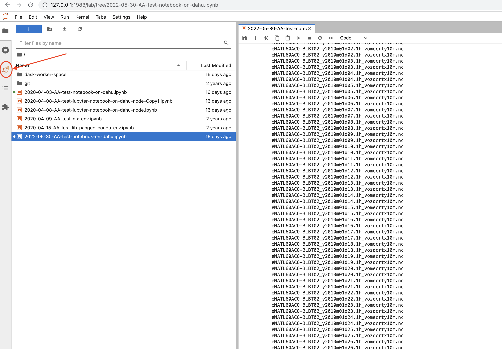
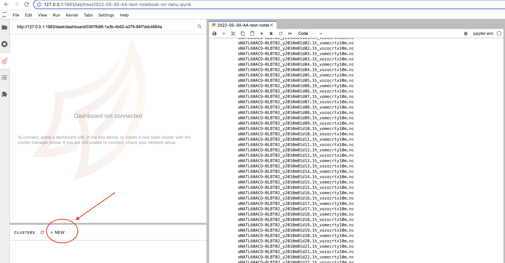

# How to compute on GriCad

--- 
## First steps (do it once)

### Perseus account

* First go and create a Perseus account https://perseus.ujf-grenoble.fr with your agalan credentials if you are working in Grenoble University, or else create an external account 
* Once your account is created, you have to join an already existing project (for now MEOM users are all gathered in pr-data-ocean) : log in to perseus, click on join a project and find pr-data-ocean in the list
* Once you are accepted in the group, you can now proceed to log to the clusters and compute

### Documentation and support
* go through the documentation : https://gricad-doc.univ-grenoble-alpes.fr
* contact sos-calcul-gricad@univ-grenoble-alpes.fr for any question


### Log in easily

* The connections to the clusters go through a bastion, so if you want to access dahu (for CPU) or bigfoot (for GPU) you first have to connect to rotule or trinity :
 - first ```ssh yourlogin@rotule.univ-grenoble-alpes.fr```  or ```ssh yourlogin@trinity.univ-grenoble-alpes.fr```
 - then ```ssh dahu or ssh bigfoot```

* To avoid doing these steps each time you want to connect, a procedure is described here : https://gricad-doc.univ-grenoble-alpes.fr/hpc/connexion/

* Repeat it on every machine you will need to work on, especially cal1 if you want to transfer data from there for instance

**Note**: the rest of the tuto will not work if you don't follow this procedure !

---
## Compute on dahu

### Connection

 * Now that you are all set up, you just have to type ```ssh dahu``` 
 * If you need to transfer some data yo can do a simple ```scp mydata dahu:/path/to/data/.```
 * If the data you want to transfer is big, go through the cargo server : ```scp mydata yourlogin@cargo.univ-grenoble-alpes.fr:/path/to/data/.```


### Submitting jobs

  * You are actually sitting on login nodes, to do some computation you will need to request some computing nodes
  * You do that by either launching your script inside a job or ask for interactive access to a computing node :

<details>
<summary>An example for interactive computing</summary>
 
 ```oarsub -l /nodes=1/core=16,walltime=03:30:00 --project pr-data-ocean -I```
 
</details>

 * When your request is granted you will be connected to a specific dahu node and you will be able to compute there.
 * Maximum time limit is 12 hours


<details>
<summary>An example job</summary>
 
 ```
 #!/bin/bash

#OAR -n jobname
#OAR -l /nodes=2/core=1,walltime=00:01:30
#OAR --stdout jobname.out
#OAR --stderr jobname.err
#OAR --project data-ocean

yourscript
```
 
</details>

 * Make sure your job script is executable ```chmod +x job.ksh``` and then launch it with ```oarsub job.ksh```

 * You can check the status of your job with ```oarstat -u yourlogin``` and kill your job if needed with ```oardel jobid``` with jobid being the first number in the result of oarsat

 * Maximum time limit on dahu is 2 days
 
 * If your code is not in the production phase yet, you can ask to test it first on a development queue by adding the option ```-t devel``` to your oarsub command or in your job with a maximum time limit of 30 minutes 
 
 * For more informations about jobs read https://gricad-doc.univ-grenoble-alpes.fr/en/hpc/joblaunch/

### See availability of Dahu nodes : 

 * Command ```chandler``` in the terminal or go to the website : https://ciment-grid.univ-grenoble-alpes.fr/clusters/dahu/monika for instaneous availablity or https://ciment-grid.univ-grenoble-alpes.fr/clusters/dahu/drawgantt/drawgantt.php for availability over time (history and forecast)

 
---
## Using Conda 

Conda is already installed. You just need to activate it using the command from the server.

```
source /applis/environments/conda.sh
```

### Create Personal Conda Environments


**Tip**: It's advisable to create conda environments in your `/bettik/username` directory. The main directory doesn't have a lot of space and you can easily fill up your home directory quota with conda packages (especially for machine learning). So use the `/bettik` directory.


1. Install Conda in Home Environment

1. Install an environment in `bettik`


Create conda from environment file:
```bash
conda env create -f environment.yml --prefix=/bettik/user/.conda/envs/env_name
```

1. Change the `.condarc` file to include all environment directories.

```bash
envs_dirs:
    - /bettik/username/.conda/envs
    - /home/username/.conda/envs
```

**Note**: You can add as many directories as you want. This just ensures that conda can talk to it.


---

## Run the jupyter notebook with conda environment on dahu (or bigfoot)

First, take a look at this tutorial to get familiar: https://gricad-doc.univ-grenoble-alpes.fr/notebook/hpcnb/

Below offers a simpler work structure.
 
**In the First Terminal** - Start the JupyterLab session

1. Log into your server


```bash
ssh dahu
```

2. Start an interactive session

```bash
oarsub -I --project data-ocean -l /core=10,walltime=2:00:00 -> it will log automatically on a login node dahuX
```

3. Activate your conda environment with JupyterLab

```
conda activate jupyter
```

4. Start your jupyterlab session


```bash
jupyter notebook --no-browser --port 1234
```


**In the second terminal** - we will do the ssh tunneling procedure to view jupyterlab on your local machine.

1. Do the Tunneling

```bash
ssh -fNL 1234:dahuX:1234  [ -L 8686:dahuX:8686 for the dashboard] dahu.ciment
```

2. Open `http://localhost:1234/?token=...(see the result of the jupyter notebook command)` on a browser in your laptop.


3. When you're done, make sure you close the tunnel you opened.


```bash
# get the process-ID number for ssh tunneling
lsof -i :1234
# kill that process
kill -9 PID
```


---
## For advanced users

### Example Environments

It's advisable to install your conda environments using `.yaml` files. This ensures that they are reproducible and it's also easier to install.

To install the first time, you can use the following command:

```bash
conda env create -f environment.yaml
```

If you already have an environment but you would like to update the environment, use this command:

```bash
conda env update -f environment.yaml
```

**Tip**: The `--prune` command ensures that you remove any packages that aren't within the `.yaml` file.

Below we have a yaml file for using conda and general Earth science packages.

<details>
<summary>General Earth Science Packages</summary>

```yaml
name: earthsci_py38
channels:
- defaults
- conda-forge
dependencies:
- python=3.8
# Standard Libraries
- numpy             # Numerical Linear Algebra
- scipy             # Scientific Computing
- xarray            # Data structures
- pandas            # Data structure
- scikit-learn      # Machine Learning
- scikit-image      # Image Processing
- statsmodels       # Statistical Learning
- pymc3             # Probabilistic programming library
# Plotting
- matplotlib
- seaborn
- bokeh
- plotly::plotly>=4.6.0
- pyviz::geoviews
- conda-forge::cartopy
- datashader
- conda-forge::cmocean
# Geospatial packages
- geopandas
- conda-forge::regionmask
- conda-forge::xesmf
- conda-forge::xcube
- conda-forge::rioxarray
# Scale
- cython
- numba
- dask              # Out-of-Core processing
- dask-ml           # Out-of-Core machine learning
# Storage
- hdf5              # standard large storage h5
- conda-forge::zarr
# GUI
- conda-forge::papermill
- conda-forge::nb_conda_kernels     # Access to other conda kernels
- conda-forge::nodejs               # for extensions in jupyterlab
- conda-forge::tqdm       
- pip
- pip:
  # GPY
  - "git+https://github.com/SheffieldML/GPy.git#egg=GPy"
  # Jupyter
  - ipykernel # access to conda
  - ipywidgets
  # Formatters
  - black
  - pylint
  - isort
  - flake8
  - mypy
  - pytest
  - pyproject
  # Extra
  -"git+https://github.com/swartn/cmipdata.git"
  - emukit
  - netCDF4
  - shapely
  - affine
  - netCDF4
  - joblib  # Embarssingly parallel
```

</details>


Below, we have a `.yaml` file for creating a Jupyter Lab environment.

<details>
<summary>JupyterLab</summary>

```yaml
name: jlab
channels:
- defaults
- conda-forge
dependencies:
- python=3.9
# GUI
- ipykernel
- conda-forge::jupyterlab           # JupyterLab GUI
- conda-forge::nb_conda_kernels     # Access to other conda kernels
- conda-forge::spyder-kernels       # Access via spyder kernels
- conda-forge::nodejs               # for extensions in jupyterlab
- conda-forge::jupyterlab-git
- conda-forge::jupyter-server-proxy
- conda-forge::ipywidgets
- pyviz::holoviews
- bokeh::bokeh
- bokeh::jupyter_bokeh              # Bokeh
- ipykernel
- tqdm                              # For status bars
- pip                               # To install other packages
- pip:
  - dask_labextension
  - lckr-jupyterlab-variableinspector
```

</details>    

**Tip**: You can make JupyterLab environment "to rule them all". And then just make other conda environments. If you install the packages `nb_conda_kernel` and `ipykernels` then your JupyterLab environment will see everything. That way you don't have to keep installing JupyterLab in every single conda environment.


---
### Use the dask dashboard to monitor your computation

 - download some extra librairies (assuming jupyter and jupyterlab are already there)
      - conda install -c conda-forge/label/cf202003 nodejs
      - pip install dask_labextension
      - jupyter labextension install dask-labextension
      - jupyter serverextension enable --py --sys-prefix dask_labextension
 - add an extra forwarding in the tunnel command :
   - ssh -NL 1234:localhost:1234 -L 8787:localhost:8787 alberta@ige-meom-cal1.u-ga.fr
 - launch jupyterlab and the dask menu should now be apparent :



 - you can now launch a dask cluster by clicking on NEW :



 

---
### Launching JupyterLab Using Jobs


Sometimes, it's a bit annoying to have to keep track of everything (launching interactive job + run jupyter notebook/lab + create tunnel, etc). So below is a way to create a simple script that helps automate the process a little bit.

Firstly, we need a bash script which can easily be launched. Below is an example.

<details>
<summary>
jlab_bash.sh
</summary>

```bash
#!/bin/bash

#OAR --name jlab_cpu
#OAR --project pr-data-ocean
#OAR -l /nodes=1,walltime=10:00:00
#OAR --stdout /bettik/username/logs/jupyterlab_cpu.log
#OAR --stderr /bettik/username/errs/jupyterlab_cpu.err

# get tunneling info
XDG_RUNTIME_DIR=""
node=$(hostname -s)
user=$(whoami)
cluster="dahu_ciment"
port=3008

# print tunneling instructions jupyter-log
echo -e "
# Tunneling Info
node=${node}
user=${user}
cluster=${cluster}
port=${port}
Command to create ssh tunnel:
ssh -N -f -L ${port}:${node}:${port} ${cluster}
Command to create ssh tunnel through
ssh -N -f -L ${port}:localhost:${port} $
Use a Browser on your local machine to go to:
localhost:${port}  (prefix w/ https:// if using password)
"


# load modules or conda environments here with jupyterlab
source activate jlab

jupyter lab --no-browser --ip=0.0.0.0 --port=${port}
```
</details>

**Note I**: make sure you create the `/logs/` and the `/errs` directory so that you can get the command to run the tunneling procedure as well as be able to debug if the script crashes for whatever reason.


---

Now here are the instructions for using it:


1. Launch the script with `oarsub`

```bash
# set permissions for the script (DO THIS ONE TIME)
chmod +x /path/to/bash/script/bash_script.sh
# launch the script
oarsub -S /path/to/bash/script/bash_script.sh
```

2. Open Port with the server name


```bash
# create a tunnel
ssh -N -f -L port_number:node_name:port_number server_name
```

3. Close the ssh tunnel when done


```bash
# get the process-ID number for ssh tunneling
lsof -i :portNumber
# kill that process
kill -9 PID
```
