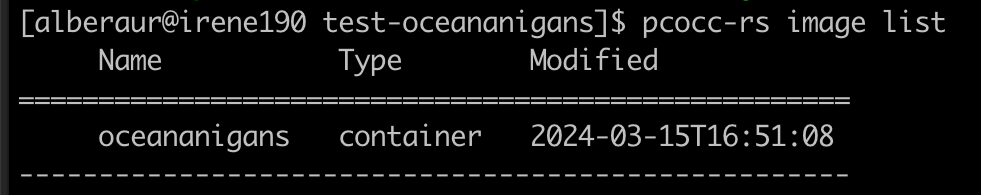

# Run oceananigans on Irene

[Oceananigans](https://github.com/CliMA/Oceananigans.jl) is a julia software that simulates incompressible fluid dynamics in Cartesian and spherical shell domains on CPUs and GPUs.

Irene does not have a direct access to internet so the julia environment needed to run oceananigans is provided via a docker image.

The docker image is stored at ```/ccc/work/cont003/gen12020/gen12020/oceananigans.tar``` so anyone in the gen12020 group should be able to access it.

To run oceananigans interactively, you need :
  - import the docker image : ```pcocc-rs image import docker-archive:/ccc/work/cont003/gen12020/gen12020/oceananigans.tar oceananigans```
  - check if the image is there : ```pcocc-rs image list```, you should get this answer :



  - run the docker image : ```pcocc-rs run oceananigans```, this should open a julia prompt in which you can run oceananigans following [this tuorial](https://github.com/CliMA/Oceananigans.jl?tab=readme-ov-file#running-your-first-model)
